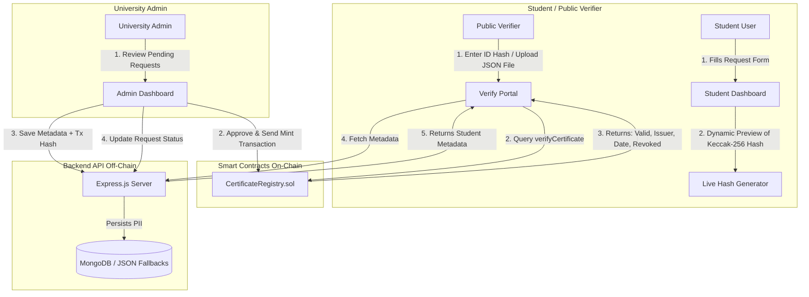

# 🎓 CertChain: Decentralized Certificate Verification System

[](https://soliditylang.org/)
[](https://opensource.org/licenses/MIT)
[](https://www.mongodb.com/)
[](https://hardhat.org/)

CertChain is a secure, transparent, and tamper-proof academic credential issuance and verification platform. It leverages a hybrid web3 architecture: preserving privacy and maintaining compliance by storing sensitive student Personally Identifiable Information (PII) off-chain, while verifying academic integrity on-chain using Ethereum smart contracts.

---

## 🏗️ System Architecture & Data Flow

CertChain balances **data privacy, blockchain transaction costs, and immutability** by splitting data storage into two discrete layers:



### 1. On-Chain Registry (Solidity / Ethereum)
* Stores only the **Certificate ID** (a deterministic 32-byte Keccak-256 hash), the issuer's wallet address, the timestamp of block confirmation, and a revocation flag.
* Zero student PII is exposed on-chain, satisfying GDPR compliance and right-to-be-forgotten standards.
* Highly gas-optimized (costing ~50,000 gas per issuance).

### 2. Off-Chain Database (MongoDB / Local JSON Fallback)
* Stores student details (Full Name, Email, Course Title, Grade/GPA, Date of Issuance, and Blockchain Transaction Hash).
* Uses the Certificate ID hash as the primary key connecting the off-chain metadata to the on-chain smart contract record.
* **Zero-Setup Database Failover**: Includes robust, self-repairing local file fallbacks (`db_fallback.json` for certificates and `requests_fallback.json` for student requests) that initialize dynamically if a local MongoDB service is not running on port `27017`.

---

## 🛠️ Technology Stack

### Smart Contracts & Blockchain
* **Language**: Solidity `0.8.24` (with strict compilation safety checks).
* **Development Environment**: Hardhat (compilation, local node emulation, and deployment scripts).
* **Library**: Ethers.js `v6` (seamless smart contract abstraction and event interaction).

### Frontend Client
* **Framework**: React `18` bootstrap via Vite for ultra-fast HMR.
* **Styling**: Tailwind CSS configured with a dynamic variable-mapped palette.
* **Theme System**: Custom Tailwind configuration supporting a polished, user-toggleable light beige theme and dark neon cyberpunk aesthetic.
* **Notifications**: React Hot Toast for real-time transaction state updates.

### Backend REST API
* **Runtime**: Node.js & Express.js.
* **Database Driver**: Mongoose for structured schema enforcement.
* **Persistence**: MongoDB Community Server or local JSON file storage.

---

## 🚀 Getting Started & Setup

### 1. Prerequisites
* **Node.js** (v18 or higher)
* **MetaMask Browser Extension**

### 2. Monorepo Installation (Root Directory)
CertChain utilizes a monorepo setup to simplify development. You can install all dependencies for both frontend and backend modules with a single command from the root folder:

```bash
# Clone the repository and enter the folder
cd "certificate verification system"

# Install monorepo dependencies (concurrently) and child workspaces
npm install
npm run install:all
```

### 3. Start Local Emulator Blockchain
In a separate terminal window, launch the Hardhat local developer blockchain and deploy the smart contract:

```bash
# Navigate to contracts workspace
cd contracts

# Run local Hardhat node (generates 20 test accounts with private keys)
npx hardhat node

# In another terminal window inside /contracts, deploy to localhost
npx hardhat run scripts/deploy.js --network localhost
```
*Note: The deployment script compiles the contract and automatically exports the ABI and deployed contract address to the frontend workspace at `frontend/src/contracts/CertificateRegistry.json`.*

### 4. Run Frontend & Backend Simultaneously
With the contract successfully deployed, you can start the API backend and Vite client concurrently in a single terminal from the root workspace:

```bash
# From the root directory
npm run dev
```

* **Frontend Client**: Running at [http://localhost:5173](http://localhost:5173)
* **Backend Express Server**: Running at [http://localhost:5000](http://localhost:5000)

---

## 📋 Comprehensive Testing Guide

Follow this step-by-step walkthrough to test the end-to-end certificate request, approval, minting, and validation lifecycle:

### Step 1: Configure MetaMask for Local Blockchain
1. Open your browser's MetaMask extension and click the Network selector dropdown.
2. Select **Add Network** -> **Add a network manually**.
3. Use the following parameters:
   * **Network Name**: Hardhat Localhost
   * **New RPC URL**: `http://127.0.0.1:8545`
   * **Chain ID**: `31337`
   * **Currency Symbol**: `ETH`
4. Click **Save** and switch your network to **Hardhat Localhost**.

### Step 2: Import Local Developer Accounts into MetaMask
1. In the console output of your running `npx hardhat node` command, find the private key for **Account #0** (designated contract owner/authorized issuer) and copy it.
2. In MetaMask, open the Account dropdown, click **Add account or hardware wallet** -> **Import account**.
3. Paste the private key and rename the imported wallet to `CertChain Admin`.
4. Copy the private key for **Account #1** (test student) and import it similarly. Rename it to `CertChain Student`.

### Step 3: Student Requests Certificate
1. Open [http://localhost:5173](http://localhost:5173) and switch your MetaMask account to `CertChain Student`.
2. Click **Connect Wallet** in the top navigation bar.
3. Navigate to the **Student** tab.
4. Fill out the request form (Name, Email, Course Title, Grade, and Issuing Institution).
5. Watch the **Preview Certificate ID (Keccak-256)** update dynamically. Click **Submit Certificate Request**.

### Step 4: Admin Approves & Mints Certificate
1. Switch your MetaMask account to the `CertChain Admin` wallet.
2. Click the **Admin** tab. You will be prompted to log in. Click **Enter as Admin**.
3. Under the **Pending Requests** tab, locate the student's request.
4. Click **Approve & Mint**. MetaMask will open. Confirm the transaction.
5. Once confirmed, the request will disappear from the pending list and register on-chain.

### Step 5: Public Verifier Validates Hash
1. Navigate to the **Verify** tab (no wallet connection is required).
2. Input the generated certificate hash (obtainable from the student's dashboard or the admin's transaction history).
3. Click **Verify**. The app queries the smart contract, fetches off-chain metadata, and renders the verified certificate card.

---

## 📁 Repository Structure

```text
├── backend/
│   ├── src/
│   │   ├── config/
│   │   │   ├── db.js              # MongoDB connector (handles loopback resolution)
│   │   │   ├── mockDb.js          # Fallback JSON store engine for certificates
│   │   │   └── mockRequestDb.js   # Fallback JSON store engine for student requests
│   │   ├── models/
│   │   │   ├── Certificate.js     # Mongoose schema for Certificate metadata
│   │   │   └── IssuanceRequest.js # Mongoose schema for Student requests
│   │   └── routes/
│   │       ├── certificates.js    # Certificate API routes
│   │       └── requests.js        # Request management API routes
│   ├── server.js                  # API bootstrap & middleware setup
│   ├── db_fallback.json           # File database for issued certificate records
│   └── requests_fallback.json     # File database for student request records
│
├── contracts/
│   ├── contracts/
│   │   └── CertificateRegistry.sol # Solidity smart contract
│   ├── scripts/
│   │   ├── deploy.js              # Deployment and compilation hook export script
│   │   └── issueTestCert.js       # Local testing helper script
│   ├── test/
│   │   └── CertificateRegistry.test.js # Hardhat smart contract unit tests
│   └── hardhat.config.js          # Hardhat compiler and port setup
│
├── frontend/
│   ├── src/
│   │   ├── components/
│   │   │   └── Navbar.jsx         # Global header with theme toggle and MetaMask state
│   │   ├── context/
│   │   │   ├── ThemeContext.jsx   # Theme state provider (HTML document class injector)
│   │   │   └── Web3Context.jsx    # Web3 state provider (Ethers connections & account checks)
│   │   ├── pages/
│   │   │   ├── Home.jsx           # Landing / Pitch page
│   │   │   ├── LoginPage.jsx      # Role selection gateway
│   │   │   ├── StudentDashboard.jsx# Student request form & request lists
│   │   │   ├── IssuePage.jsx      # Issuer action panel & manual issuance form
│   │   │   └── VerifyPage.jsx     # Certificate hash query & JSON metadata uploader
│   │   ├── contracts/
│   │   │   └── CertificateRegistry.json # Deployed address and contract ABI
│   │   └── index.css              # Glassmorphism helpers and theme properties
│   └── tailwind.config.js         # Custom Tailwind v3 theme variables mappings
│
├── package.json                   # Root workspace configurations
└── README.md                      # Detailed project documentation
```

---

## 🔒 Smart Contract Safety & Testing

The `CertificateRegistry.sol` smart contract includes comprehensive unit tests verifying access control structures (only authorized issuers can mint, revoke, or authorize others), revocation status changes, and duplicate prevention.

To run contract unit tests:
```bash
cd contracts
npx hardhat test
```
