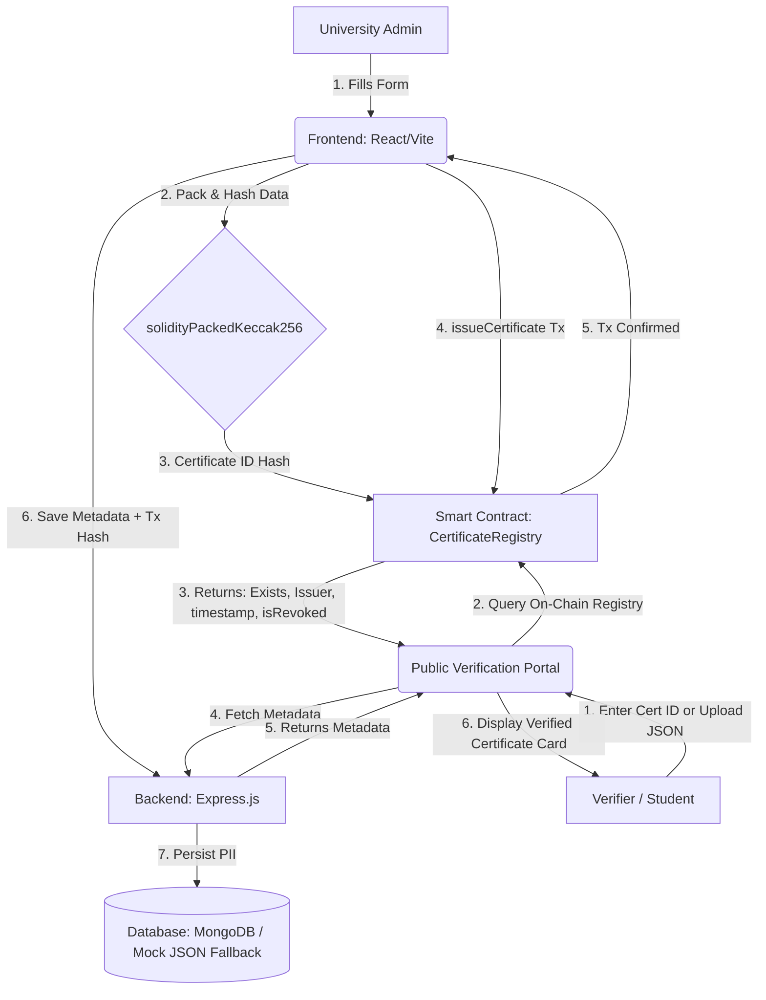

# 🎓 CertChain: Decentralized Certificate Verification System

CertChain is a secure, transparent, and tamper-proof academic credential issuance and verification platform. It uses a hybrid architecture: traditional off-chain storage for student PII (Personally Identifiable Information) and an Ethereum smart contract for on-chain integrity verification.

---

## 🏗️ System Architecture

CertChain splits data storage into two layers to balance **privacy, cost, and immutability**:



1. **On-Chain Registry (Solidity / Ethereum)**:
   - Stores only a cryptographic signature / fingerprint (`bytes32` ID hash), the issuer's wallet address, the timestamp, and the revocation status.
   - Minimizes gas fees (costs ~50k gas to issue) and prevents storing sensitive PII directly on a public ledger (GDPR/privacy compliance).

2. **Off-Chain Database (MongoDB / Local JSON Fallback)**:
   - Stores human-readable details (Student Name, Course, Email, Grade, Date, and Ethereum Tx Hash).
   - Linked to the blockchain using the Certificate ID (hash) as the primary key.
   - Includes a **robust local failover database** (`db_fallback.json`) that initializes automatically if a local MongoDB server is not running on port `27017` to ensure zero setup development.

---

## 🛠️ Technology Stack

- **Frontend**: React (Vite), Tailwind CSS (custom Glassmorphism theme), Ethers.js v6.
- **Backend**: Node.js (Express), Mongoose.
- **Blockchain**: Solidity 0.8.24, Hardhat (local node/Sepolia Network).

---

## 🚀 Getting Started

### 1. Prerequisites
- **Node.js** (v18+)
- **MetaMask Extension** installed in your browser.

### 2. Smart Contract Setup & Local Blockchain
```bash
# Navigate to contracts directory
cd contracts

# Install dependencies (if not already installed)
npm install

# Start local Hardhat Node (simulates local blockchain)
npx hardhat node

# In a new terminal, deploy smart contract to the local network
npx hardhat run scripts/deploy.js --network localhost
```
*Note: The deploy script automatically copies the contract address and ABI to `frontend/src/contracts/CertificateRegistry.json`.*

### 3. Backend Setup
```bash
# Navigate to backend directory
cd backend

# Install dependencies
npm install

# Copy .env configuration
copy .env.example .env

# Run the API server
npm run dev
```
*Note: If no local MongoDB is detected on port 27017, the server automatically initializes `db_fallback.json` so you can continue testing immediately.*

### 4. Frontend Setup
```bash
# Navigate to frontend directory
cd frontend

# Install dependencies
npm install

# Start Vite server
npm run dev
```
Open `http://localhost:5173` in your browser.

---

## 📁 Repository Structure

```text
├── backend/
│   ├── src/
│   │   ├── config/
│   │   │   ├── db.js          # Mongoose configuration & fallback logic
│   │   │   └── mockDb.js      # Mock database engine using JSON file
│   │   ├── models/
│   │   │   └── Certificate.js # Mongoose schema for off-chain metadata
│   │   └── routes/
│   │       └── certificates.js# API endpoints (POST / GET / List)
│   ├── server.js              # Express app bootstrap
│   └── db_fallback.json       # Auto-created fallback database file
│
├── contracts/
│   ├── contracts/
│   │   └── CertificateRegistry.sol # Main smart contract
│   ├── scripts/
│   │   ├── deploy.js          # Deploys contract & exports ABI/address
│   │   └── issueTestCert.js   # Script to register test certificate
│   ├── test/
│   │   └── CertificateRegistry.test.js # 26 comprehensive unit tests
│   └── hardhat.config.js      # Hardhat configuration
│
└── frontend/
    ├── src/
    │   ├── components/
    │   │   └── Navbar.jsx     # Header with MetaMask connection status
    │   ├── context/
    │   │   └── Web3Context.jsx# Wallet connection & Ethers state provider
    │   ├── pages/
    │   │   ├── Home.jsx       # Landing page with call-to-actions
    │   │   ├── IssuePage.jsx  # Issuer Form & history table
    │   │   └── VerifyPage.jsx # Verification portal (Search/JSON Upload)
    │   └── contracts/
    │       └── CertificateRegistry.json # Deployed address & ABI
```


